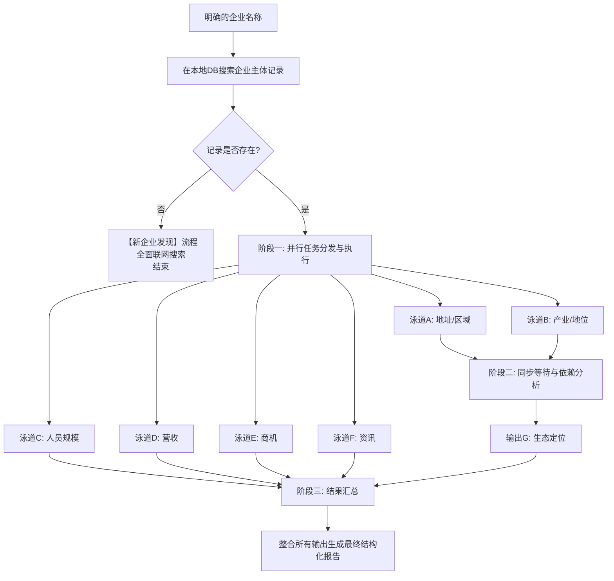

# 并行处理架构设计

## 📋 概述

基于用户提供的细化工作流程图，本文档详细描述了城市大脑企业信息处理系统的并行处理架构设计，实现多泳道并行任务执行和依赖管理。

## 🏊‍♂️ 多泳道并行处理架构

### 流程概览


## 🔧 技术实现架构

### 核心组件设计

#### 1. 任务编排器 (Task Orchestrator)
```python
# services/task_orchestrator.py
import asyncio
from typing import Dict, List, Any, Optional
from datetime import datetime, timedelta
from dataclasses import dataclass
from enum import Enum

class TaskStatus(Enum):
    PENDING = "pending"
    RUNNING = "running"
    COMPLETED = "completed"
    FAILED = "failed"
    SKIPPED = "skipped"

@dataclass
class TaskResult:
    task_id: str
    status: TaskStatus
    data: Any
    error: Optional[str] = None
    execution_time: Optional[float] = None
    timestamp: datetime = None

class ParallelTaskOrchestrator:
    def __init__(self):
        self.task_results: Dict[str, TaskResult] = {}
        self.task_dependencies: Dict[str, List[str]] = {}
        
    async def execute_enterprise_processing(self, enterprise_id: int, enterprise_name: str) -> Dict[str, Any]:
        """
        执行企业信息处理的完整流程
        """
        processing_context = {
            "enterprise_id": enterprise_id,
            "enterprise_name": enterprise_name,
            "start_time": datetime.now(),
            "stage": "initialization"
        }
        
        try:
            # 阶段一: 并行任务分发与执行
            stage1_results = await self._execute_stage1_parallel_tasks(processing_context)
            processing_context["stage1_results"] = stage1_results
            processing_context["stage"] = "stage1_completed"
            
            # 阶段二: 同步等待与依赖分析
            stage2_results = await self._execute_stage2_dependency_analysis(processing_context)
            processing_context["stage2_results"] = stage2_results
            processing_context["stage"] = "stage2_completed"
            
            # 阶段三: 结果汇总
            final_result = await self._execute_stage3_result_integration(processing_context)
            processing_context["final_result"] = final_result
            processing_context["stage"] = "completed"
            
            return {
                "status": "success",
                "processing_context": processing_context,
                "final_result": final_result,
                "execution_time": (datetime.now() - processing_context["start_time"]).total_seconds()
            }
            
        except Exception as e:
            return {
                "status": "error",
                "error": str(e),
                "processing_context": processing_context,
                "execution_time": (datetime.now() - processing_context["start_time"]).total_seconds()
            }
    
    async def _execute_stage1_parallel_tasks(self, context: Dict[str, Any]) -> Dict[str, TaskResult]:
        """
        阶段一: 执行6个并行泳道任务
        """
        enterprise_id = context["enterprise_id"]
        enterprise_name = context["enterprise_name"]
        
        # 创建6个并行任务
        tasks = [
            self._execute_lane_a_address_region(enterprise_id, enterprise_name),
            self._execute_lane_b_industry_position(enterprise_id, enterprise_name),
            self._execute_lane_c_personnel_scale(enterprise_id, enterprise_name),
            self._execute_lane_d_revenue(enterprise_id, enterprise_name),
            self._execute_lane_e_business_opportunities(enterprise_id, enterprise_name),
            self._execute_lane_f_news_information(enterprise_id, enterprise_name)
        ]
        
        # 并行执行所有任务
        results = await asyncio.gather(*tasks, return_exceptions=True)
        
        # 整理结果
        lane_results = {}
        lane_names = ["lane_a", "lane_b", "lane_c", "lane_d", "lane_e", "lane_f"]
        
        for i, result in enumerate(results):
            lane_name = lane_names[i]
            if isinstance(result, Exception):
                lane_results[lane_name] = TaskResult(
                    task_id=lane_name,
                    status=TaskStatus.FAILED,
                    data=None,
                    error=str(result)
                )
            else:
                lane_results[lane_name] = result
        
        return lane_results
    
    async def _execute_stage2_dependency_analysis(self, context: Dict[str, Any]) -> Dict[str, TaskResult]:
        """
        阶段二: 等待泳道A和B完成，执行产业大脑与产业链定位分析
        """
        stage1_results = context["stage1_results"]
        
        # 检查泳道A和B是否成功完成
        lane_a_result = stage1_results.get("lane_a")
        lane_b_result = stage1_results.get("lane_b")
        
        if (lane_a_result and lane_a_result.status == TaskStatus.COMPLETED and
            lane_b_result and lane_b_result.status == TaskStatus.COMPLETED):
            
            # 执行生态定位分析
            ecosystem_analysis = await self._execute_ecosystem_positioning_analysis(
                lane_a_result.data,  # 区域信息
                lane_b_result.data   # 产业信息
            )
            
            return {
                "ecosystem_positioning": TaskResult(
                    task_id="ecosystem_positioning",
                    status=TaskStatus.COMPLETED,
                    data=ecosystem_analysis,
                    timestamp=datetime.now()
                )
            }
        else:
            return {
                "ecosystem_positioning": TaskResult(
                    task_id="ecosystem_positioning",
                    status=TaskStatus.FAILED,
                    data=None,
                    error="泳道A或B未成功完成，无法执行生态定位分析",
                    timestamp=datetime.now()
                )
            }
    
    async def _execute_stage3_result_integration(self, context: Dict[str, Any]) -> Dict[str, Any]:
        """
        阶段三: 整合所有输出，生成最终结构化报告
        """
        stage1_results = context["stage1_results"]
        stage2_results = context["stage2_results"]
        
        # 收集所有成功的结果
        integrated_data = {
            "enterprise_id": context["enterprise_id"],
            "enterprise_name": context["enterprise_name"],
            "processing_timestamp": datetime.now().isoformat(),
            "data_sources": {}
        }
        
        # 整合阶段一结果
        for lane_name, result in stage1_results.items():
            if result.status == TaskStatus.COMPLETED:
                integrated_data["data_sources"][lane_name] = {
                    "data": result.data,
                    "timestamp": result.timestamp.isoformat() if result.timestamp else None,
                    "execution_time": result.execution_time
                }
        
        # 整合阶段二结果
        for analysis_name, result in stage2_results.items():
            if result.status == TaskStatus.COMPLETED:
                integrated_data["data_sources"][analysis_name] = {
                    "data": result.data,
                    "timestamp": result.timestamp.isoformat() if result.timestamp else None,
                    "execution_time": result.execution_time
                }
        
        # 生成结构化报告
        structured_report = await self._generate_structured_report(integrated_data)
        
        return {
            "integrated_data": integrated_data,
            "structured_report": structured_report,
            "data_completeness": self._calculate_data_completeness(stage1_results, stage2_results),
            "processing_summary": self._generate_processing_summary(stage1_results, stage2_results)
        }
    
    def _calculate_data_completeness(self, stage1_results: Dict[str, TaskResult], 
                                   stage2_results: Dict[str, TaskResult]) -> Dict[str, Any]:
        """
        计算数据完整性
        """
        total_tasks = len(stage1_results) + len(stage2_results)
        completed_tasks = 0
        
        for result in stage1_results.values():
            if result.status == TaskStatus.COMPLETED:
                completed_tasks += 1
        
        for result in stage2_results.values():
            if result.status == TaskStatus.COMPLETED:
                completed_tasks += 1
        
        completeness_score = completed_tasks / total_tasks if total_tasks > 0 else 0
        
        return {
            "total_tasks": total_tasks,
            "completed_tasks": completed_tasks,
            "completeness_score": completeness_score,
            "completeness_percentage": f"{completeness_score * 100:.1f}%"
        }
```

#### 2. 泳道任务实现

##### 泳道A: 地址/区域信息处理
```python
async def _execute_lane_a_address_region(self, enterprise_id: int, enterprise_name: str) -> TaskResult:
    """
    泳道A: 地址/区域信息处理
    """
    start_time = datetime.now()
    task_id = "lane_a_address_region"
    
    try:
        # 1. 查本地地址
        local_address = await self.db_service.get_enterprise_address(enterprise_id)
        
        if local_address and not self._is_address_expired(local_address, years=1):
            # 使用本地地址
            result_data = {
                "source": "local",
                "address_info": local_address,
                "region_info": await self._extract_region_info(local_address)
            }
        else:
            # 联网搜索地址
            search_result = await self.search_service.search_enterprise_address(enterprise_name)
            
            if search_result:
                # 更新数据库
                await self.db_service.update_enterprise_address(
                    enterprise_id, 
                    search_result,
                    update_time=datetime.now()
                )
                
                result_data = {
                    "source": "web_search",
                    "address_info": search_result,
                    "region_info": await self._extract_region_info(search_result)
                }
            else:
                result_data = {
                    "source": "none",
                    "address_info": None,
                    "region_info": None,
                    "error": "无法获取地址信息"
                }
        
        execution_time = (datetime.now() - start_time).total_seconds()
        
        return TaskResult(
            task_id=task_id,
            status=TaskStatus.COMPLETED,
            data=result_data,
            execution_time=execution_time,
            timestamp=datetime.now()
        )
        
    except Exception as e:
        execution_time = (datetime.now() - start_time).total_seconds()
        return TaskResult(
            task_id=task_id,
            status=TaskStatus.FAILED,
            data=None,
            error=str(e),
            execution_time=execution_time,
            timestamp=datetime.now()
        )

def _is_address_expired(self, address_data: Dict[str, Any], years: int = 1) -> bool:
    """
    检查地址数据是否过期
    """
    if not address_data.get("updated_at"):
        return True
    
    updated_at = address_data["updated_at"]
    if isinstance(updated_at, str):
        updated_at = datetime.fromisoformat(updated_at)
    
    expiry_date = updated_at + timedelta(days=365 * years)
    return datetime.now() > expiry_date
```

##### 泳道B: 产业/地位信息处理
```python
async def _execute_lane_b_industry_position(self, enterprise_id: int, enterprise_name: str) -> TaskResult:
    """
    泳道B: 产业/地位信息处理
    """
    start_time = datetime.now()
    task_id = "lane_b_industry_position"
    
    try:
        # 1. 查本地产业信息
        local_industry = await self.db_service.get_enterprise_industry(enterprise_id)
        
        if local_industry and not self._is_industry_expired(local_industry, years=1):
            # 使用本地产业信息
            result_data = {
                "source": "local",
                "industry_info": local_industry,
                "position_analysis": await self._analyze_industry_position(local_industry)
            }
        else:
            # 联网搜索产业信息
            search_result = await self.search_service.search_enterprise_industry(enterprise_name)
            
            if search_result:
                # 使用LLM分析产业地位
                industry_analysis = await self.llm_service.analyze_industry_position(
                    enterprise_name, 
                    search_result
                )
                
                # 更新数据库
                await self.db_service.update_enterprise_industry(
                    enterprise_id,
                    {
                        "industry_info": search_result,
                        "position_analysis": industry_analysis,
                        "updated_at": datetime.now()
                    }
                )
                
                result_data = {
                    "source": "web_search",
                    "industry_info": search_result,
                    "position_analysis": industry_analysis
                }
            else:
                result_data = {
                    "source": "none",
                    "industry_info": None,
                    "position_analysis": None,
                    "error": "无法获取产业信息"
                }
        
        execution_time = (datetime.now() - start_time).total_seconds()
        
        return TaskResult(
            task_id=task_id,
            status=TaskStatus.COMPLETED,
            data=result_data,
            execution_time=execution_time,
            timestamp=datetime.now()
        )
        
    except Exception as e:
        execution_time = (datetime.now() - start_time).total_seconds()
        return TaskResult(
            task_id=task_id,
            status=TaskStatus.FAILED,
            data=None,
            error=str(e),
            execution_time=execution_time,
            timestamp=datetime.now()
        )
```

##### 泳道C: 人员规模信息处理
```python
async def _execute_lane_c_personnel_scale(self, enterprise_id: int, enterprise_name: str) -> TaskResult:
    """
    泳道C: 人员规模信息处理
    """
    start_time = datetime.now()
    task_id = "lane_c_personnel_scale"
    
    try:
        # 1. 查本地规模信息
        local_scale = await self.db_service.get_enterprise_personnel_scale(enterprise_id)
        
        if local_scale and not self._is_scale_expired(local_scale, months=6):
            # 使用本地规模信息
            result_data = {
                "source": "local",
                "personnel_scale": local_scale,
                "scale_category": self._categorize_scale(local_scale)
            }
        else:
            # 联网搜索规模信息
            search_result = await self.search_service.search_enterprise_scale(enterprise_name)
            
            if search_result:
                # 使用LLM提取结构化规模信息
                structured_scale = await self.llm_service.extract_personnel_scale(search_result)
                
                # 更新数据库
                await self.db_service.update_enterprise_personnel_scale(
                    enterprise_id,
                    structured_scale,
                    update_time=datetime.now()
                )
                
                result_data = {
                    "source": "web_search",
                    "personnel_scale": structured_scale,
                    "scale_category": self._categorize_scale(structured_scale)
                }
            else:
                result_data = {
                    "source": "none",
                    "personnel_scale": None,
                    "scale_category": None,
                    "error": "无法获取人员规模信息"
                }
        
        execution_time = (datetime.now() - start_time).total_seconds()
        
        return TaskResult(
            task_id=task_id,
            status=TaskStatus.COMPLETED,
            data=result_data,
            execution_time=execution_time,
            timestamp=datetime.now()
        )
        
    except Exception as e:
        execution_time = (datetime.now() - start_time).total_seconds()
        return TaskResult(
            task_id=task_id,
            status=TaskStatus.FAILED,
            data=None,
            error=str(e),
            execution_time=execution_time,
            timestamp=datetime.now()
        )

def _is_scale_expired(self, scale_data: Dict[str, Any], months: int = 6) -> bool:
    """
    检查规模数据是否过期（6个月）
    """
    if not scale_data.get("updated_at"):
        return True
    
    updated_at = scale_data["updated_at"]
    if isinstance(updated_at, str):
        updated_at = datetime.fromisoformat(updated_at)
    
    expiry_date = updated_at + timedelta(days=30 * months)
    return datetime.now() > expiry_date

def _categorize_scale(self, scale_data: Dict[str, Any]) -> str:
    """
    根据人员规模进行分类
    """
    if not scale_data or not scale_data.get("employee_count"):
        return "未知"
    
    employee_count = scale_data["employee_count"]
    
    if employee_count < 50:
        return "小微企业"
    elif employee_count < 300:
        return "小型企业"
    elif employee_count < 1000:
        return "中型企业"
    else:
        return "大型企业"
```

##### 泳道D: 营收信息处理
```python
async def _execute_lane_d_revenue(self, enterprise_id: int, enterprise_name: str) -> TaskResult:
    """
    泳道D: 营收信息处理
    """
    start_time = datetime.now()
    task_id = "lane_d_revenue"
    
    try:
        # 1. 查本地营收信息
        local_revenue = await self.db_service.get_enterprise_revenue(enterprise_id)
        
        if local_revenue and not self._is_revenue_expired(local_revenue, months=6):
            # 使用本地营收信息
            result_data = {
                "source": "local",
                "revenue_info": local_revenue,
                "revenue_trend": await self._analyze_revenue_trend(local_revenue)
            }
        else:
            # 联网搜索营收信息
            search_result = await self.search_service.search_enterprise_revenue(enterprise_name)
            
            if search_result:
                # 使用LLM提取结构化营收信息
                structured_revenue = await self.llm_service.extract_revenue_info(search_result)
                
                # 更新数据库
                await self.db_service.update_enterprise_revenue(
                    enterprise_id,
                    structured_revenue,
                    update_time=datetime.now()
                )
                
                result_data = {
                    "source": "web_search",
                    "revenue_info": structured_revenue,
                    "revenue_trend": await self._analyze_revenue_trend(structured_revenue)
                }
            else:
                result_data = {
                    "source": "none",
                    "revenue_info": None,
                    "revenue_trend": None,
                    "error": "无法获取营收信息"
                }
        
        execution_time = (datetime.now() - start_time).total_seconds()
        
        return TaskResult(
            task_id=task_id,
            status=TaskStatus.COMPLETED,
            data=result_data,
            execution_time=execution_time,
            timestamp=datetime.now()
        )
        
    except Exception as e:
        execution_time = (datetime.now() - start_time).total_seconds()
        return TaskResult(
            task_id=task_id,
            status=TaskStatus.FAILED,
            data=None,
            error=str(e),
            execution_time=execution_time,
            timestamp=datetime.now()
        )
```

##### 泳道E: 商机信息处理
```python
async def _execute_lane_e_business_opportunities(self, enterprise_id: int, enterprise_name: str) -> TaskResult:
    """
    泳道E: 商机信息处理（近3个月）
    """
    start_time = datetime.now()
    task_id = "lane_e_business_opportunities"
    
    try:
        # 联网搜索近3个月的商机信息
        search_result = await self.search_service.search_business_opportunities(
            enterprise_name,
            time_range="3months"
        )
        
        if search_result:
            # 使用LLM分析商机信息
            opportunities_analysis = await self.llm_service.analyze_business_opportunities(
                enterprise_name,
                search_result
            )
            
            result_data = {
                "source": "web_search",
                "opportunities": search_result,
                "analysis": opportunities_analysis,
                "search_period": "近3个月"
            }
        else:
            result_data = {
                "source": "none",
                "opportunities": None,
                "analysis": None,
                "search_period": "近3个月",
                "error": "未找到相关商机信息"
            }
        
        execution_time = (datetime.now() - start_time).total_seconds()
        
        return TaskResult(
            task_id=task_id,
            status=TaskStatus.COMPLETED,
            data=result_data,
            execution_time=execution_time,
            timestamp=datetime.now()
        )
        
    except Exception as e:
        execution_time = (datetime.now() - start_time).total_seconds()
        return TaskResult(
            task_id=task_id,
            status=TaskStatus.FAILED,
            data=None,
            error=str(e),
            execution_time=execution_time,
            timestamp=datetime.now()
        )
```

##### 泳道F: 资讯信息处理
```python
async def _execute_lane_f_news_information(self, enterprise_id: int, enterprise_name: str) -> TaskResult:
    """
    泳道F: 资讯信息处理
    """
    start_time = datetime.now()
    task_id = "lane_f_news_information"
    
    try:
        # 联网搜索新闻资讯
        news_search_result = await self.search_service.search_enterprise_news(enterprise_name)
        
        if news_search_result:
            # 使用LLM总结新闻信息
            news_summary = await self.llm_service.summarize_news(
                enterprise_name,
                news_search_result
            )
            
            result_data = {
                "source": "web_search",
                "news_articles": news_search_result,
                "summary": news_summary,
                "article_count": len(news_search_result.get("articles", []))
            }
        else:
            result_data = {
                "source": "none",
                "news_articles": None,
                "summary": None,
                "article_count": 0,
                "error": "未找到相关新闻资讯"
            }
        
        execution_time = (datetime.now() - start_time).total_seconds()
        
        return TaskResult(
            task_id=task_id,
            status=TaskStatus.COMPLETED,
            data=result_data,
            execution_time=execution_time,
            timestamp=datetime.now()
        )
        
    except Exception as e:
        execution_time = (datetime.now() - start_time).total_seconds()
        return TaskResult(
            task_id=task_id,
            status=TaskStatus.FAILED,
            data=None,
            error=str(e),
            execution_time=execution_time,
            timestamp=datetime.now()
        )
```

#### 3. 生态定位分析
```python
async def _execute_ecosystem_positioning_analysis(self, region_info: Dict[str, Any], 
                                                industry_info: Dict[str, Any]) -> Dict[str, Any]:
    """
    执行本地产业大脑与产业链定位分析
    """
    try:
        # 获取本地产业大脑信息
        region_name = region_info.get("region_info", {}).get("city")
        industry_category = industry_info.get("industry_info", {}).get("category")
        
        if region_name and industry_category:
            # 查询本地产业大脑
            local_industry_brains = await self.db_service.get_industry_brains_by_region_and_industry(
                region_name, 
                industry_category
            )
            
            # 查询产业链信息
            supply_chain_info = await self.db_service.get_supply_chain_info(industry_category)
            
            # 使用LLM进行生态定位分析
            ecosystem_analysis = await self.llm_service.analyze_ecosystem_positioning(
                region_info=region_info,
                industry_info=industry_info,
                industry_brains=local_industry_brains,
                supply_chain_info=supply_chain_info
            )
            
            return {
                "region_name": region_name,
                "industry_category": industry_category,
                "local_industry_brains": local_industry_brains,
                "supply_chain_position": supply_chain_info,
                "ecosystem_analysis": ecosystem_analysis,
                "positioning_confidence": ecosystem_analysis.get("confidence_score", 0.0)
            }
        else:
            return {
                "error": "缺少区域或产业信息，无法进行生态定位分析",
                "region_name": region_name,
                "industry_category": industry_category
            }
            
    except Exception as e:
        return {
            "error": f"生态定位分析失败: {str(e)}",
            "region_info": region_info,
            "industry_info": industry_info
        }
```

#### 4. 结构化报告生成
```python
async def _generate_structured_report(self, integrated_data: Dict[str, Any]) -> Dict[str, Any]:
    """
    生成最终结构化报告（不需要code，只对结构进行check）
    """
    try:
        # 数据结构检查和验证
        report_structure = {
            "enterprise_basic_info": {
                "name": integrated_data["enterprise_name"],
                "id": integrated_data["enterprise_id"],
                "processing_time": integrated_data["processing_timestamp"]
            },
            "data_completeness": {
                "address_region": self._check_data_structure(integrated_data, "lane_a"),
                "industry_position": self._check_data_structure(integrated_data, "lane_b"),
                "personnel_scale": self._check_data_structure(integrated_data, "lane_c"),
                "revenue_info": self._check_data_structure(integrated_data, "lane_d"),
                "business_opportunities": self._check_data_structure(integrated_data, "lane_e"),
                "news_information": self._check_data_structure(integrated_data, "lane_f"),
                "ecosystem_positioning": self._check_data_structure(integrated_data, "ecosystem_positioning")
            },
            "structured_content": {},
            "data_quality_score": 0.0,
            "recommendations": []
        }
        
        # 结构化内容组织
        data_sources = integrated_data.get("data_sources", {})
        
        for source_name, source_data in data_sources.items():
            if source_data and source_data.get("data"):
                report_structure["structured_content"][source_name] = {
                    "status": "available",
                    "data_type": type(source_data["data"]).__name__,
                    "timestamp": source_data.get("timestamp"),
                    "content_summary": self._summarize_content_structure(source_data["data"])
                }
            else:
                report_structure["structured_content"][source_name] = {
                    "status": "unavailable",
                    "reason": "数据获取失败或为空"
                }
        
        # 计算数据质量评分
        report_structure["data_quality_score"] = self._calculate_overall_quality_score(
            report_structure["data_completeness"]
        )
        
        # 生成改进建议
        report_structure["recommendations"] = self._generate_improvement_recommendations(
            report_structure["data_completeness"],
            report_structure["data_quality_score"]
        )
        
        return report_structure
        
    except Exception as e:
        return {
            "error": f"结构化报告生成失败: {str(e)}",
            "integrated_data": integrated_data
        }

def _check_data_structure(self, integrated_data: Dict[str, Any], source_key: str) -> Dict[str, Any]:
    """
    检查数据结构完整性
    """
    data_sources = integrated_data.get("data_sources", {})
    source_data = data_sources.get(source_key)
    
    if not source_data:
        return {
            "status": "missing",
            "completeness": 0.0,
            "issues": ["数据源缺失"]
        }
    
    data = source_data.get("data")
    if not data:
        return {
            "status": "empty",
            "completeness": 0.0,
            "issues": ["数据为空"]
        }
    
    # 检查数据结构完整性
    issues = []
    completeness_score = 1.0
    
    if isinstance(data, dict):
        if data.get("error"):
            issues.append(f"数据获取错误: {data['error']}")
            completeness_score *= 0.3
        
        if data.get("source") == "none":
            issues.append("未能获取有效数据")
            completeness_score *= 0.5
        
        # 检查关键字段
        required_fields = self._get_required_fields_by_source(source_key)
        missing_fields = []
        
        for field in required_fields:
            if not data.get(field):
                missing_fields.append(field)
        
        if missing_fields:
            issues.append(f"缺少关键字段: {', '.join(missing_fields)}")
            completeness_score *= (1 - len(missing_fields) / len(required_fields))
    
    return {
        "status": "available" if completeness_score > 0.5 else "incomplete",
        "completeness": max(0.0, completeness_score),
        "issues": issues if issues else ["数据结构完整"]
    }

def _get_required_fields_by_source(self, source_key: str) -> List[str]:
    """
    根据数据源获取必需字段列表
    """
    field_mapping = {
        "lane_a": ["address_info", "region_info"],
        "lane_b": ["industry_info", "position_analysis"],
        "lane_c": ["personnel_scale", "scale_category"],
        "lane_d": ["revenue_info", "revenue_trend"],
        "lane_e": ["opportunities", "analysis"],
        "lane_f": ["news_articles", "summary"],
        "ecosystem_positioning": ["ecosystem_analysis", "positioning_confidence"]
    }
    
    return field_mapping.get(source_key, [])

def _summarize_content_structure(self, data: Any) -> Dict[str, Any]:
    """
    总结内容结构
    """
    if isinstance(data, dict):
        return {
            "type": "object",
            "keys": list(data.keys()),
            "key_count": len(data.keys()),
            "has_nested_objects": any(isinstance(v, dict) for v in data.values()),
            "has_arrays": any(isinstance(v, list) for v in data.values())
        }
    elif isinstance(data, list):
        return {
            "type": "array",
            "length": len(data),
            "item_types": list(set(type(item).__name__ for item in data))
        }
    else:
        return {
            "type": type(data).__name__,
            "value_preview": str(data)[:100] if len(str(data)) > 100 else str(data)
        }

def _calculate_overall_quality_score(self, completeness_data: Dict[str, Any]) -> float:
    """
    计算整体数据质量评分
    """
    if not completeness_data:
        return 0.0
    
    total_score = 0.0
    valid_sources = 0
    
    for source_name, source_completeness in completeness_data.items():
        if isinstance(source_completeness, dict) and "completeness" in source_completeness:
            total_score += source_completeness["completeness"]
            valid_sources += 1
    
    return total_score / valid_sources if valid_sources > 0 else 0.0

def _generate_improvement_recommendations(self, completeness_data: Dict[str, Any], 
                                        overall_score: float) -> List[str]:
    """
    生成改进建议
    """
    recommendations = []
    
    if overall_score < 0.6:
        recommendations.append("整体数据完整性较低，建议优化数据获取流程")
    
    for source_name, source_data in completeness_data.items():
        if isinstance(source_data, dict):
            completeness = source_data.get("completeness", 0.0)
            issues = source_data.get("issues", [])
            
            if completeness < 0.5:
                recommendations.append(f"{source_name}: 数据完整性不足，建议检查数据源")
            
            if issues and "数据获取错误" in str(issues):
                recommendations.append(f"{source_name}: 存在数据获取错误，建议检查API连接")
    
    if not recommendations:
        recommendations.append("数据质量良好，建议定期更新以保持时效性")
    
    return recommendations
```

## 🔄 API接口设计

### 企业信息处理接口
```python
# api/enterprise_processing.py
from fastapi import APIRouter, HTTPException, BackgroundTasks
from typing import Dict, Any
from services.task_orchestrator import ParallelTaskOrchestrator

router = APIRouter(prefix="/api/v1/enterprise-processing", tags=["企业信息处理"])

@router.post("/process/{enterprise_id}")
async def process_enterprise_information(
    enterprise_id: int,
    background_tasks: BackgroundTasks,
    force_refresh: bool = False
) -> Dict[str, Any]:
    """
    处理企业信息的完整流程
    """
    try:
        # 获取企业基本信息
        enterprise = await enterprise_service.get_enterprise(enterprise_id)
        if not enterprise:
            raise HTTPException(status_code=404, detail="企业不存在")
        
        # 创建任务编排器
        orchestrator = ParallelTaskOrchestrator()
        
        # 执行并行处理流程
        result = await orchestrator.execute_enterprise_processing(
            enterprise_id=enterprise_id,
            enterprise_name=enterprise["name"]
        )
        
        return {
            "status": "success",
            "message": "企业信息处理完成",
            "data": result
        }
        
    except Exception as e:
        raise HTTPException(status_code=500, detail=f"处理失败: {str(e)}")

@router.get("/status/{enterprise_id}")
async def get_processing_status(enterprise_id: int) -> Dict[str, Any]:
    """
    获取企业信息处理状态
    """
    try:
        # 获取处理状态（从缓存或数据库）
        status = await processing_status_service.get_status(enterprise_id)
        
        return {
            "enterprise_id": enterprise_id,
            "status": status
        }
        
    except Exception as e:
        raise HTTPException(status_code=500, detail=f"获取状态失败: {str(e)}")
```

## 📊 监控和性能指标

### 关键性能指标 (KPIs)
1. **并行处理效率**
   - 6个泳道任务的平均执行时间
   - 并行度利用率
   - 任务成功率

2. **数据质量指标**
   - 数据完整性评分
   - 数据时效性
   - 错误率统计

3. **系统性能指标**
   - API响应时间
   - 缓存命中率
   - 数据库查询性能

### 监控实现
```python
# monitoring/performance_monitor.py
import time
from typing import Dict, Any
from datetime import datetime

class PerformanceMonitor:
    def __init__(self):
        self.metrics = {}
    
    async def record_lane_execution(self, lane_name: str, execution_time: float, status: str):
        """
        记录泳道执行指标
        """
        if lane_name not in self.metrics:
            self.metrics[lane_name] = {
                "total_executions": 0,
                "successful_executions": 0,
                "total_time": 0.0,
                "average_time": 0.0,
                "success_rate": 0.0
            }
        
        metrics = self.metrics[lane_name]
        metrics["total_executions"] += 1
        metrics["total_time"] += execution_time
        
        if status == "completed":
            metrics["successful_executions"] += 1
        
        metrics["average_time"] = metrics["total_time"] / metrics["total_executions"]
        metrics["success_rate"] = metrics["successful_executions"] / metrics["total_executions"]
    
    def get_performance_summary(self) -> Dict[str, Any]:
        """
        获取性能摘要
        """
        return {
            "timestamp": datetime.now().isoformat(),
            "lane_metrics": self.metrics,
            "overall_performance": self._calculate_overall_performance()
        }
    
    def _calculate_overall_performance(self) -> Dict[str, Any]:
        """
        计算整体性能指标
        """
        if not self.metrics:
            return {"status": "no_data"}
        
        total_avg_time = sum(m["average_time"] for m in self.metrics.values()) / len(self.metrics)
        total_success_rate = sum(m["success_rate"] for m in self.metrics.values()) / len(self.metrics)
        
        return {
            "average_execution_time": total_avg_time,
            "overall_success_rate": total_success_rate,
            "active_lanes": len(self.metrics),
            "performance_grade": self._grade_performance(total_avg_time, total_success_rate)
        }
    
    def _grade_performance(self, avg_time: float, success_rate: float) -> str:
        """
        性能等级评定
        """
        if success_rate >= 0.95 and avg_time <= 5.0:
            return "优秀"
        elif success_rate >= 0.90 and avg_time <= 10.0:
            return "良好"
        elif success_rate >= 0.80 and avg_time <= 20.0:
            return "一般"
        else:
            return "需要优化"
```

---

*文档版本：v1.0*
*更新时间：2025年9月26日*