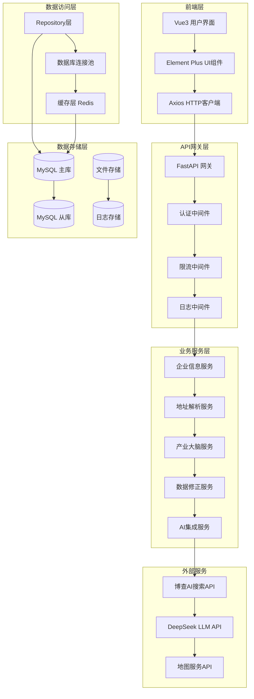

# 城市大脑企业信息处理系统开发方案

## 📋 项目概述

城市大脑企业信息处理系统是一个智能化的企业信息查询和产业链分析平台，旨在通过整合本地数据库、联网搜索和大语言模型技术，为用户提供企业及其关联产业信息的结构化总结和智能分析。

### 核心功能
- 🏢 企业信息智能提取与查询
- 🔍 联网搜索补充缺失信息
- 🧠 AI驱动的结构化信息总结
- 📊 产业链关系分析与可视化
- 🗺️ 地址信息标准化与修正
- 📈 数据质量监控与优化

### 技术栈
- **后端**: Python + FastAPI + SQLAlchemy + MySQL
- **前端**: Vue3 + TypeScript + Element Plus + Vite
- **AI服务**: DeepSeek API + 博查AI搜索API
- **缓存**: Redis
- **部署**: Docker + Kubernetes
- **监控**: Prometheus + Grafana

## 🎯 系统架构设计

### 整体架构图



### 微服务架构设计

#### 1. 企业信息服务 (Enterprise Service)
- 企业基础信息管理
- 企业名称提取与标准化
- 企业信息查询与搜索
- 企业数据验证与清洗

#### 2. 地址解析服务 (Address Service)
- 地址信息标准化
- 地理位置解析
- 地址搜索与修正
- 地区信息管理

#### 3. 产业大脑服务 (Industry Brain Service)
- 产业大脑信息管理
- 产业链关系分析
- 行业分类与匹配
- 链主企业推荐

#### 4. 数据修正服务 (Data Correction Service)
- 数据质量监控
- 自动数据修正
- 数据验证规则管理
- 修正历史记录

#### 5. AI集成服务 (AI Integration Service)
- 大语言模型集成
- 联网搜索集成
- 信息结构化处理
- AI结果缓存管理

## 📊 数据处理流程

### 核心业务流程

#### 1. 用户输入与企业名称提取
- 接收用户输入信息，通过AI模型识别并提取企业名称
- 若未提取到企业名称，提示用户补充相关信息

#### 2. 本地数据库检索判断
- 使用提取的企业名称查询本地数据库
- 存在本地数据时，执行本地数据处理流程
- 不存在时，执行联网搜索流程

#### 3. 本地数据处理分支
**信息完整情况**：
- 将全部数据提交至 LLM，生成结构化总结
- 输出总结结果给用户

**信息缺失情况**：
- 记录缺失字段，通过联网搜索补充缺失信息
- 将完整数据提交至 LLM 格式化处理
- 更新本地数据库（补充缺失字段及关联信息）

#### 4. 无本地数据处理流程
- 联网搜索该企业的基础信息（营收、人员规模等）
- 根据企业所属地区，获取对应地区的产业信息、链主企业信息、产业大脑信息
- 将全部信息提交至 LLM 格式化处理
- 将完整数据录入本地数据库的相应表中

## 🗄️ 数据库设计

### 核心数据表关系
```
enterprise (统一企业表)
  ├── enterprise_address (企业地址表)
  ├── enterprise_relationship (企业关系表)
  └── data_quality_log (数据质量日志表)

industry (行业信息表)
  └── industry_brain (产业大脑表)

area (地区信息表)
```

### 数据迁移策略

#### 阶段一：影子表创建
- 创建新的统一表结构
- 建立数据迁移映射表
- 保持现有业务正常运行

#### 阶段二：数据迁移
- 迁移客户企业数据
- 迁移链主企业数据
- 建立企业关系
- 数据验证和报告生成

#### 阶段三：平滑切换
- 双写策略验证
- 逐步切换读操作
- 最终下线旧表

## 🚀 分阶段实施策略

### 阶段一：数据完善优先（当前阶段 - 1-2周）
- ✅ 保持现有架构稳定，继续使用当前表结构
- ✅ 专注于数据添加和完善
- ✅ 建立数据导入的标准流程
- ✅ 完善数据修正功能

### 阶段二：数据分析和设计（数据添加完成后 - 1个月后）
- 📊 数据现状分析和重复数据识别
- 🔍 数据质量评估和清理
- 📐 设计新的统一表结构

### 阶段三：渐进式重构（数据稳定后 - 2-3个月后）
- 🏗️ 实施架构重构
- 🔧 微服务化改造
- ⚡ 性能优化

## 📋 详细实施文档

本开发方案包含以下详细文档：

1. **[数据库设计方案](./docs/DATABASE_DESIGN.md)** - 详细的数据库表结构和迁移策略
2. **[后端技术实现](./docs/BACKEND_IMPLEMENTATION.md)** - FastAPI应用架构和服务实现
3. **[前端技术实现](./docs/FRONTEND_IMPLEMENTATION.md)** - Vue3应用架构和组件设计
4. **[AI服务集成](./docs/AI_SERVICES.md)** - AI服务集成和处理流程
5. **[部署运维方案](./docs/DEPLOYMENT_GUIDE.md)** - Docker容器化和K8s部署
6. **[监控日志方案](./docs/MONITORING_LOGGING.md)** - 系统监控和日志管理
7. **[数据质量管理](./docs/DATA_QUALITY.md)** - 数据质量监控和修正策略

## 🎯 项目里程碑

### 近期目标（1-2周）
- [x] 完成现有系统功能梳理
- [x] 建立数据导入标准流程
- [ ] 完善数据修正功能
- [ ] 添加数据源和批次标识字段
- [ ] 建立数据质量监控

### 中期目标（1个月后）
- [ ] 数据添加基本完成
- [ ] 开始数据分析和重复清理
- [ ] 设计新的统一表结构
- [ ] 创建统一查询视图

### 长期目标（2-3个月后）
- [ ] 实施架构重构
- [ ] 微服务化改造
- [ ] 性能优化
- [ ] 容器化部署

## 📝 已完成的工作总结

### 系统功能完善
1. ✅ **服务启动**：成功启动前后端服务（后端9003端口，前端9002端口）
2. ✅ **代码重构**：按最佳实践重构queries.py，实现模块化和repository模式
3. ✅ **数据修正**：实现智能地址搜索和数据库更新功能
4. ✅ **前端修复**：修复"修正数据"按钮功能，支持链主企业数据修正

### 数据质量改进
1. ✅ **地址修正逻辑**：实现联网搜索企业地址并提取正确城市信息
2. ✅ **数据库更新**：创建地址更新机制，将修正后的数据保存到数据库
3. ✅ **API优化**：新增链主企业更新API，完善数据修正功能

### 架构优化准备
1. ✅ **模块化重构**：实现repository模式，为后续架构升级奠定基础
2. ✅ **数据质量工具**：建立地址搜索和修正的完整工具链
3. ✅ **向后兼容**：保持所有现有功能正常运行

## 🎉 总结

本开发方案采用分阶段实施策略，既保证了业务连续性，又为后续的系统升级提供了坚实基础。通过"先业务后架构"的策略，确保在数据完善的同时，逐步实现系统的现代化改造。

---

*文档创建时间：2025年9月26日*
*版本：v1.0*